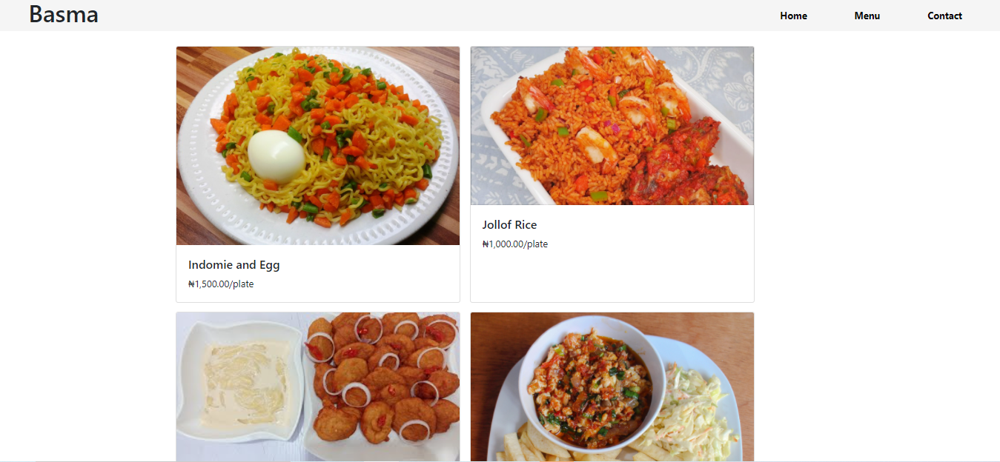

# Resturant_page

This is part of the Restuarant Project in [The Odin Project's](https://www.theodinproject.com/courses/javascript/lessons/restaurant-page?ref=lnav) Javascript Curriculum.


- [Live Demo Link]()




## Built With

- HTML
- JavaScript
- BootStrap

## Getting Started

To get a local copy of the repository please run the following commands on your terminal:

```bash
$ cd <folder>
$ git clone 
$ cd into  the cloned repo
$ Open a terminal and 'run npm install'
$ Run the command npm run build
$ Open the dist folder in the root of the app, open the index.html file witha browser(Chrome, Firefox...)
```

## Author

👤 **Adesuyi Adetola**

- Github: [@Arinpe](https://github.com/Arinpe)
- Twitter: [@_detola_](https://twitter.com/_detola_)
- LinkedIn: [@aadetola](https://www.linkedin.com/in/aadetola/)

## 🤝 Contributing

Contributions, issues and feature requests are welcome!

Feel free to check the [issues page](https://github.com/GraceOyiza/Resturant_page/issues).

## Show your support

Give a ⭐️ if you like this project!

## Acknowledgments

- Microverse
- Odin Project

## 📝 License
